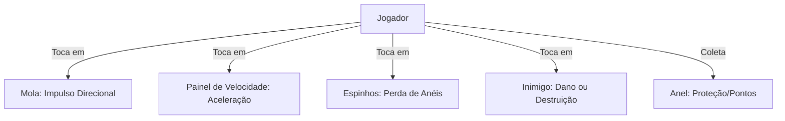

# Documentação do Platformer Kit - Sistema de Level Design (Paçoca)

Esta documentação detalha a estrutura de assets, métricas físicas e diretrizes de design do **Platformer Kit** (Kenney) usado no projeto **Paçoca**. O objetivo deste documento é servir de contexto para prompts futuros na geração automatizada ou assistida de fases (levels).

---

## 1. Regras Espaciais e Alinhamento (2.5D)

O jogo **Paçoca** é um jogo de plataforma 3D rápido (estilo Sonic) com jogabilidade travada em um plano bidimensional.

> [!IMPORTANT]
> **Alinhamento do Eixo Z:**
> * Toda a física de movimentação do jogador, patrulha de inimigos, coleta de anéis e ativação de molas ocorre estritamente na coordenada **`Z = 0`**.
> * Os blocos de plataforma devem cobrir a faixa de jogo (comumente escalados com profundidade no eixo Z entre `2.0` e `4.0` unidades) para evitar que o jogador ou inimigos caiam visualmente ou fisicamente pelas bordas.
> * O limite de queda livre (**Death Pit**) onde o jogador morre instantaneamente é **`Y < -15.0`**.

---

## 2. Métricas e Comportamento Físico

Para planejar a disposição dos blocos e obstáculos, use as seguintes métricas baseadas na física do jogador:

### Velocidade e Salto do Jogador
* **MaxSpeed (Velocidade Máxima):** `24.0` unidades/s.
* **JumpVelocity (Força do Pulo):** `15.0` unidades/s (trajetória parabólica padrão).
* **Air Dash:** O jogador pode realizar um impulso adicional no ar (custa o pulo duplo), que aplica um impulso rápido com velocidade de `18.0` unidades/s em diagonal superior (`45°`) ou vertical reta, suspendendo temporariamente a gravidade por `0.15s`.
* **Gravidade:** `35.0` unidades/s².

### Mecânica de Momento em Rampas
O jogador acelera ao descer e desacelera ao subir rampas devido ao peso da gravidade alinhado ao vetor normal do chão.
* **Rampa Suave (`block-grass-large-slope.glb`):**
  * **Dimensões:** `2.0` de largura (X) por `1.0` de altura (Y).
  * **Inclinação:** Relação `1:2` (inclinação de `0.5` ou `~26.5°`).
  * **Propósito:** Permite manter velocidade constante e correr sem perder o fluxo da corrida.
* **Rampa Íngreme (`block-grass-large-slope-steep.glb`):**
  * **Dimensões:** `2.0` de largura (X) por `2.0` de altura (Y).
  * **Inclinação:** Relação `1:1` (inclinação de `1.0` ou `45°`).
  * **Propósito:** Funciona como parede ou desafio. Exige que o jogador venha com velocidade embalada ou utilize o **Spin Dash** no pé da rampa para conseguir subir.

---

## 3. Catálogo de Blocos de Terreno

Os blocos de terreno padrão vêm em duas principais variações visuais: **Grass** (Grama - padrão para áreas ensolaradas) e **Snow** (Neve - para áreas congeladas). Todos os blocos usam colisores estáticos (`StaticBody3D`).

| Modelo GLB | Nome no Grid | Dimensões (X, Y, Z) | Pivot | Descrição e Propósito no Level Design |
| :--- | :--- | :--- | :--- | :--- |
| `block-grass-large.glb` | Bloco Plano Grande | $2.0 \times 1.0 \times 2.0$ | Centro | Bloco principal para construir plataformas sólidas de corrida. Espaçamento padrão de $2.0$ no eixo X. |
| `block-grass-low.glb` | Bloco Plano Baixo | $1.0 \times 0.5 \times 1.0$ | Centro | Plataformas flutuantes menores e mais finas, usadas para trechos de precisão. Espaçamento de $1.0$ no eixo X. |
| `block-grass-large-slope.glb` | Rampa Suave | $2.0 \times 1.0 \times 2.0$ | Centro | Rampa para ganho/perda de momento. Sobe $1$ unidade em Y a cada $2$ unidades em X. |
| `block-grass-large-slope-steep.glb` | Rampa Íngreme | $2.0 \times 2.0 \times 2.0$ | Centro | Rampa íngreme de 45°. Sobe $2$ unidades em Y a cada $2$ unidades em X. |
| `block-grass-curve.glb` | Bloco Curvo | $2.0 \times 1.0 \times 2.0$ | Centro | Usado para cantos estéticos e curvas de pistas que mudam de direção visual (embora a física continue travada em Z=0). |
| `block-grass-corner.glb` | Canto de Bloco | $1.0 \times 1.0 \times 1.0$ | Centro | Acabamento estético de bordas de plataformas suspensas. |

> [!NOTE]
> Para todas as versões de Neve, substitua `-grass-` por `-snow-` nos nomes dos arquivos (ex: `block-snow-large.glb`). Ambos possuem o mesmo comportamento de colisão.

---

## 4. Elementos Interativos e Mecânicas (Cenas customizadas)

Esses objetos possuem lógica própria implementada via scripts C# no Godot e devem ser instanciados usando suas respectivas cenas (`.tscn`).



### A. Mola (`res://scenes/spring.tscn`)
* **Modelo Visual:** `trap-spikes.glb` ou `spring.glb`
* **Tipo Godot:** `Area3D` com script `Spring.cs`
* **Parâmetros Editáveis:**
  * `LaunchForce` (Padrão: `22.0`): A intensidade do impulso.
  * `LaunchDirection` (Padrão: `Vector3(0, 1, 0)`): Direção do impulso. Molas verticais jogam o jogador para cima; molas diagonais (ex: `Vector3(1.2, 1.5, 0)`) são ideais para cruzar abismos em alta velocidade.
  * `ControlLockDuration` (Padrão: `0.5`): Tempo em segundos que o jogador fica impossibilitado de alterar a direção no teclado, garantindo que ele complete a parábola desenhada pela mola.
* **Uso no Design:** Cruzamento de fossos, atalhos elevados e redirecionamento de fluxo.

### B. Painel de Velocidade (`res://scenes/dash_pad.tscn`)
* **Modelo Visual:** `conveyor-belt.glb` ou customizado
* **Tipo Godot:** `Area3D` com script `DashPad.cs`
* **Parâmetros Editáveis:**
  * `BoostForce` (Padrão: `32.0`): Velocidade instantânea que o jogador atinge ao passar pelo painel.
  * `BoostDirection` (Padrão: `Vector3(1, 0, 0)`): Direção do impulso (normalmente direita ou esquerda).
  * `ControlLockDuration` (Padrão: `0.4`): Tempo de trava de controle do jogador.
* **Comportamento:** Força o jogador a entrar no estado de **Rolo (Rolling)**, permitindo que ele destrua inimigos no caminho e passe por túneis baixos.
* **Uso no Design:** Início de pistas de velocidade ou rampas para decolagem de longo alcance.

### C. Anel (`res://scenes/ring.tscn`)
* **Modelo Visual:** Modelo de anel giratório
* **Tipo Godot:** `Area3D` com script `Ring.cs`
* **Comportamento:** Quando coletado, aumenta os anéis do jogador. Se o jogador for atingido por um perigo (inimigo ou espinho) e possuir anéis, ele perde todos os anéis, que se espalham de forma física na tela para que possam ser recoletados. Se for atingido com 0 anéis, o jogador morre.
* **Uso no Design:** Devem ser dispostos em arcos lineares ou parábolas de pulo, servindo como uma pista visual (guia) para o jogador saber onde pular e qual velocidade manter.

---

## 5. Inimigos e Perigos

### A. Inimigo Básico (`res://scenes/enemy.tscn`)
* **Modelo Visual:** `character-oobi.glb` ou variantes
* **Tipo Godot:** `CharacterBody3D` com script `Enemy.cs`
* **Comportamento:** Patrulha horizontalmente em uma velocidade definida por `Speed`. Ele vira automaticamente na direção oposta ao colidir com uma parede ou ao detectar a proximidade de um penhasco (cliff edge).
* **Interação com o Jogador:**
  * Se o jogador tocá-lo por cima (caindo) ou estiver no estado de **Rolo/Spin Dash**, o inimigo é destruído e o jogador ganha um impulso de pulo de `10.0` unidades/s.
  * Caso contrário, o jogador sofre dano (perde anéis ou morre).
* **Uso no Design:** Placer em plataformas retas para interromper o fluxo simples de corrida, exigindo que o jogador pule ou use Spin Dash para atropelá-lo.

### B. Espinhos (`res://scenes/spikes.tscn`)
* **Modelo Visual:** `trap-spikes.glb`
* **Tipo Godot:** `Area3D` com script `Spikes.cs`
* **Comportamento:** Causa dano instantâneo ao jogador que entrar em contato com sua área de colisão.
* **Uso no Design:** Posicionados em fossos (entre plataformas) ou no pé de paredes para punir quedas e erros de tempo no pulo.

### C. Outros Perigos em Potencial (Assets do Kit)
* `saw.glb`: Serra giratória de movimentação constante. Excelente obstáculo de tempo (o jogador deve esperar passar).
* `bomb.glb`: Mina estática que explode ao toque.
* `spike-block-wide.glb` / `spike-block.glb`: Paredes de espinhos estáticos.

---

## 6. Elementos Estruturais e Decorativos

Estes modelos servem para dar acabamento visual e estrutural às fases, além de fornecer pontos de referência e orientação espacial para o jogador.

| Categoria | Modelos GLB Recomendados | Propósito no Level Design |
| :--- | :--- | :--- |
| **Sinalização** | `arrow.glb`, `arrows.glb`, `sign.glb` | Indicar a direção do fluxo da fase em bifurcações ou alertar sobre perigos iminentes à frente. |
| **Vegetação** | `tree.glb`, `tree-pine.glb`, `tree-snow.glb`, `flowers.glb`, `grass.glb` | Enriquecer visualmente o cenário. Devem ser colocados levemente ao fundo (Z ligeiramente negativo, como `Z = -1.8`) para não obstruir a visão da gameplay em Z=0. |
| **Estruturas** | `fence-straight.glb`, `fence-corner.glb`, `fence-rope.glb` | Delimitar visualmente caminhos e beiradas de plataformas. |
| **Obstáculos Físicos** | `crate.glb`, `crate-strong.glb`, `barrel.glb` | Podem ser empilhados para criar barreiras físicas simples que bloqueiam o caminho do jogador, exigindo um pulo ou destruição (se configurados como quebráveis). |
| **Progressão** | `door-open.glb`, `door-large-open.glb` | Usados para representar o portal ou portão de chegada do Goal (fim da fase). |

---

## 7. Diretrizes de Composição e Padrões (Patterns) de Fases

Ao gerar ou planejar fases para o **Paçoca**, siga estes padrões clássicos de design de plataformas de alta velocidade:

### Padrão 1: Pista de Lançamento (Launch Pad)
1. Coloque um **Dash Pad** apontando para a direita em uma reta livre.
2. Posicione uma fileira horizontal de **Rings** (5 a 8 anéis) logo após o Dash Pad.
3. No final da reta, coloque uma **Rampa Suave** (`block-grass-large-slope.glb`) inclinando para cima.
4. O momento gerado fará o jogador decolar em uma parábola perfeita. Coloque um arco parabólico de **Rings** no ar para indicar a trajetória ideal.

### Padrão 2: O Fosso de Espinhos (Spike Pit Gap)
1. Duas plataformas elevadas separadas por um vão de $6$ a $10$ unidades de distância.
2. O chão do vão deve conter vários **Spikes** (`res://scenes/spikes.tscn`) lado a lado em `Y = -3.0` (ou posicionado adequadamente abaixo da altura das plataformas).
3. No meio do fosso, pode haver plataformas flutuantes estreitas de precisão utilizando `block-grass-low.glb` com **Rings** em cima.

### Padrão 3: O Salto Assistido por Mola (Spring Jump)
1. Uma parede intransponível de $6.0$ unidades de altura.
2. Uma **Mola Vertical** colocada próxima à base da parede com `LaunchForce = 22.0` e `ControlLockDuration = 0.5`.
3. Isso lança o jogador verticalmente, permitindo-lhe pousar em segurança em cima da plataforma elevada.

### Padrão 4: Rota de Alta Velocidade vs Rota de Segurança
* **Rota Superior (Alta Velocidade):** Requer pulos precisos e o uso de molas e Dash Pads. Oferece mais anéis, menos perigos e caminhos mais rápidos.
* **Rota Inferior (Segurança/Erro):** Se o jogador falhar nos pulos superiores, cai nesta rota. Contém mais inimigos, espinhos, plataformas menores e velocidade reduzida.

---

## 8. Exemplo de Estrutura de Coordenadas para Prompt de Geração

Ao pedir para construir uma fase, o modelo deve gerar os objetos usando posicionamento absoluto no plano XY. 

Abaixo está uma referência de grid linear para um segmento simples de fase:

```json
{
  "spawn_point": { "x": -12.0, "y": 1.5, "z": 0.0 },
  "platforms": [
    { "type": "grass_large", "start_x": -20.0, "end_x": 10.0, "y": -0.5, "z_depth": 4.0 },
    { "type": "slope_up", "start_x": 10.0, "end_x": 16.0, "start_y": -0.5, "end_y": 2.5, "z_depth": 4.0 },
    { "type": "grass_large", "start_x": 16.0, "end_x": 36.0, "y": 2.5, "z_depth": 4.0 }
  ],
  "interactives": [
    { "type": "dash_pad", "x": -16.0, "y": 0.0, "z": 0.0, "direction": [1.0, 0.0, 0.0], "force": 32.0 },
    { "type": "ring_arc", "start_x": -6.0, "end_x": 2.0, "y": 1.2, "count": 5 },
    { "type": "enemy", "x": 5.0, "y": 0.5, "z": 0.0, "speed": 2.5 },
    { "type": "spring", "x": 32.5, "y": 3.0, "z": 0.0, "direction": [0.0, 1.0, 0.0], "force": 22.0 }
  ]
}
```

> [!TIP]
> Utilize sempre as proporções corretas de distância. Um pulo padrão sem velocidade correta alcança cerca de $4$ unidades horizontalmente. Um pulo correndo na velocidade máxima (`MaxSpeed`) alcança facilmente $12$ a $15$ unidades de distância.
