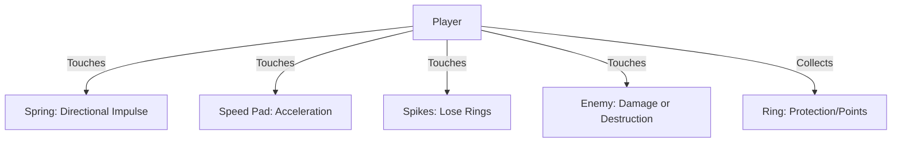

# Platformer Kit Documentation - Level Design System (Paçoca)

This documentation details the asset structure, physical metrics, and design guidelines of the **Platformer Kit** (Kenney) used in the **Paçoca** project. The goal of this document is to serve as context for future prompts in automated or assisted level generation.

---

## 1. Spatial Rules and Alignment (2.5D)

The game **Paçoca** is a fast-paced 3D platformer (Sonic-style) with gameplay locked to a two-dimensional plane.

> [!IMPORTANT]
> **Z-Axis Alignment:**
> * All player movement physics, enemy patrols, ring collection, and spring activations occur strictly at the **`Z = 0`** coordinate.
> * Platform blocks must cover the gameplay lane (commonly scaled with a Z-axis depth between `2.0` and `4.0` units) to prevent the player or enemies from visually or physically falling off the edges.
> * The free-fall boundary (**Death Pit**) where the player dies instantly is **`Y < -15.0`**.

---

## 2. Metrics and Physical Behavior

To plan the layout of blocks and obstacles, use the following metrics based on player physics:

### Player Speed and Jumping
* **MaxSpeed:** `24.0` units/s.
* **JumpVelocity:** `15.0` units/s (standard parabolic trajectory).
* **Air Dash:** The player can perform an additional boost in the air (costs the double jump), which applies a quick impulse at `18.0` units/s diagonally upward (`45°`) or straight vertically, temporarily suspending gravity for `0.15s`.
* **Gravity:** `35.0` units/s².

### Slope Momentum Mechanics
The player accelerates when going down and decelerates when going up ramps due to the force of gravity aligned with the floor's normal vector.
* **Smooth Slope (`block-grass-large-slope.glb`):**
  * **Dimensions:** `2.0` wide (X) by `1.0` high (Y).
  * **Inclination:** `1:2` ratio (slope of `0.5` or `~26.5°`).
  * **Purpose:** Allows maintaining a constant speed and running without losing momentum.
* **Steep Slope (`block-grass-large-slope-steep.glb`):**
  * **Dimensions:** `2.0` wide (X) by `2.0` high (Y).
  * **Inclination:** `1:1` ratio (slope of `1.0` or `45°`).
  * **Purpose:** Functions as a wall or a challenge. Requires the player to approach with built-up speed or use the **Spin Dash** at the foot of the ramp to climb.

---

## 3. Terrain Block Catalog

Standard terrain blocks come in two main visual variations: **Grass** (standard for sunny areas) and **Snow** (for frozen areas). All blocks use static colliders (`StaticBody3D`).

| GLB Model | Grid Name | Dimensions (X, Y, Z) | Pivot | Description and Purpose in Level Design |
| :--- | :--- | :--- | :--- | :--- |
| `block-grass-large.glb` | Large Flat Block | $2.0 \times 1.0 \times 2.0$ | Center | Main block for building solid running platforms. Standard spacing of $2.0$ on the X axis. |
| `block-grass-low.glb` | Low Flat Block | $1.0 \times 0.5 \times 1.0$ | Center | Smaller and thinner floating platforms, used for precision sections. Spacing of $1.0$ on the X-axis. |
| `block-grass-large-slope.glb` | Smooth Slope | $2.0 \times 1.0 \times 2.0$ | Center | Slope for gaining/losing momentum. Rises $1$ Y unit for every $2$ X units. |
| `block-grass-large-slope-steep.glb` | Steep Slope | $2.0 \times 2.0 \times 2.0$ | Center | Steep 45° slope. Rises $2$ Y units for every $2$ X units. |
| `block-grass-curve.glb` | Curved Block | $2.0 \times 1.0 \times 2.0$ | Center | Used for aesthetic corners and curves of tracks that change visual direction (though physics remain locked to Z=0). |
| `block-grass-corner.glb` | Block Corner | $1.0 \times 1.0 \times 1.0$ | Center | Aesthetic finish for the edges of suspended platforms. |

> [!NOTE]
> For all Snow versions, replace `-grass-` with `-snow-` in the file names (e.g., `block-snow-large.glb`). Both have the same collision behavior.

---

## 4. Interactive Elements and Mechanics (Custom Scenes)

These objects have their own logic implemented via C# scripts in Godot and must be instantiated using their respective scenes (`.tscn`).



### A. Spring (`res://scenes/spring.tscn`)
* **Visual Model:** `trap-spikes.glb` or `spring.glb`
* **Godot Type:** `Area3D` with `Spring.cs` script
* **Editable Parameters:**
  * `LaunchForce` (Default: `22.0`): The intensity of the launch.
  * `LaunchDirection` (Default: `Vector3(0, 1, 0)`): The direction of the launch. Vertical springs launch the player straight up; diagonal springs (e.g., `Vector3(1.2, 1.5, 0)`) are ideal for crossing pits at high speed.
  * `ControlLockDuration` (Default: `0.5`): Time in seconds during which the player cannot alter direction via keyboard, ensuring they complete the trajectory designed by the spring.
* **Usage in Design:** Pit crossings, high-altitude shortcuts, and flow redirecting.

### B. Speed Pad (`res://scenes/dash_pad.tscn`)
* **Visual Model:** `conveyor-belt.glb` or custom
* **Godot Type:** `Area3D` with `DashPad.cs` script
* **Editable Parameters:**
  * `BoostForce` (Default: `32.0`): Instantaneous speed the player reaches when passing through the pad.
  * `BoostDirection` (Default: `Vector3(1, 0, 0)`): Boost direction (usually right or left).
  * `ControlLockDuration` (Default: `0.4`): Time player control is locked.
* **Behavior:** Forces the player into the **Rolling** state, allowing them to destroy enemies along the path and fit through low tunnels.
* **Usage in Design:** Start of speed tracks or launch ramps for long-range jumps.

### C. Ring (`res://scenes/ring.tscn`)
* **Visual Model:** Rotating ring model
* **Godot Type:** `Area3D` with `Ring.cs` script
* **Behavior:** When collected, increases the player's ring count. If the player is hit by a hazard (enemy or spikes) and has rings, they lose all rings, which scatter with physics on the screen to be re-collected. If hit with 0 rings, the player dies.
* **Usage in Design:** Should be arranged in linear arcs or jump parabolas, serving as a visual guide for the player to know where to jump and what speed to maintain.

---

## 5. Enemies and Hazards

### A. Basic Enemy (`res://scenes/enemy.tscn`)
* **Visual Model:** `character-oobi.glb` or variants
* **Godot Type:** `CharacterBody3D` with `Enemy.cs` script
* **Behavior:** Patrols horizontally at a speed defined by `Speed`. It automatically turns in the opposite direction when colliding with a wall or when detecting a cliff edge.
* **Player Interaction:**
  * If the player touches it from above (falling) or is in the **Rolling/Spin Dash** state, the enemy is destroyed and the player gains a jump boost of `10.0` units/s.
  * Otherwise, the player takes damage (loses rings or dies).
* **Usage in Design:** Placed on flat platforms to interrupt simple running flow, requiring the player to jump or use Spin Dash to run them over.

### B. Spikes (`res://scenes/spikes.tscn`)
* **Visual Model:** `trap-spikes.glb`
* **Godot Type:** `Area3D` with `Spikes.cs` script
* **Behavior:** Causes instant damage to any player that enters its collision area.
* **Usage in Design:** Positioned in pits (between platforms) or at the foot of walls to punish falls and incorrect jump timing.

### C. Other Potential Hazards (Kit Assets)
* `saw.glb`: Rotating saw with constant movement. Excellent timing obstacle (the player must wait for it to pass).
* `bomb.glb`: Static mine that explodes on contact.
* `spike-block-wide.glb` / `spike-block.glb`: Static spike walls.

---

## 6. Structural and Decorative Elements

These models serve to provide visual polish and structure to the levels, as well as reference points and spatial orientation for the player.

| Category | Recommended GLB Models | Purpose in Level Design |
| :--- | :--- | :--- |
| **Signage** | `arrow.glb`, `arrows.glb`, `sign.glb` | Indicate the flow direction at forks or warn of upcoming hazards. |
| **Vegetation** | `tree.glb`, `tree-pine.glb`, `tree-snow.glb`, `flowers.glb`, `grass.glb` | Rich visual background. Should be placed slightly in the background (Z slightly negative, such as `Z = -1.8`) to not obstruct gameplay at Z=0. |
| **Structures** | `fence-straight.glb`, `fence-corner.glb`, `fence-rope.glb` | Visually define paths and platform edges. |
| **Physical Obstacles** | `crate.glb`, `crate-strong.glb`, `barrel.glb` | Can be stacked to create simple barriers blocking the player's path, requiring a jump or destruction (if breakable). |
| **Progression** | `door-open.glb`, `door-large-open.glb` | Used to represent the arrival gate at the Goal (end of level). |

---

## 7. Composition Guidelines and Level Design Patterns

When generating or planning levels for **Paçoca**, follow these classic speed platformer design patterns:

### Pattern 1: Launch Pad
1. Place a **Dash Pad** pointing to the right on a clear straight path.
2. Position a horizontal line of **Rings** (5 to 8 rings) immediately after the Dash Pad.
3. At the end of the straight path, place a **Smooth Slope** (`block-grass-large-slope.glb`) inclining upward.
4. The generated momentum will launch the player in a perfect parabola. Place a parabolic arc of **Rings** in the air to guide the ideal trajectory.

### Pattern 2: The Spike Pit Gap
1. Two elevated platforms separated by a gap of $6$ to $10$ units of distance.
2. The bottom of the gap should contain several **Spikes** (`res://scenes/spikes.tscn`) side by side at `Y = -3.0` (or positioned appropriately below the platforms).
3. In the middle of the pit, there can be narrow floating precision platforms using `block-grass-low.glb` with **Rings** on top.

### Pattern 3: The Spring Jump
1. An impassable wall $6.0$ units high.
2. A **Vertical Spring** placed near the base of the wall with `LaunchForce = 22.0` and `ControlLockDuration = 0.5`.
3. This launches the player vertically, allowing them to land safely on top of the elevated platform.

### Pattern 4: High-Speed Route vs. Safe Route
* **Upper Route (High Speed):** Requires precise jumps and the use of springs and Dash Pads. Offers more rings, fewer hazards, and faster paths.
* **Lower Route (Safe/Error fallback):** If the player fails upper jumps, they fall to this route. Contains more enemies, spikes, smaller platforms, and reduced speed.

---

## 8. Coordinate Structure Example for Generation Prompt

When asking to construct a stage, the model should generate objects using absolute positioning on the XY plane.

Below is a linear grid reference for a simple stage segment:

```json
{
  "spawn_point": { "x": -12.0, "y": 1.5, "z": 0.0 },
  "platforms": [
    { "type": "grass_large", "start_x": -20.0, "end_x": 10.0, "y": -0.5, "z_depth": 4.0 },
    { "type": "slope_up", "start_x": 10.0, "end_x": 16.0, "start_y": -0.5, "end_y": 2.5, "z_depth": 4.0 },
    { "type": "grass_large", "start_x": 16.0, "end_x": 36.0, "y": 2.5, "z_depth": 4.0 }
  ],
  "interactives": [
    { "type": "dash_pad", "x": -16.0, "y": 0.0, "z": 0.0, "direction": [1.0, 0.0, 0.0], "force": 32.0 },
    { "type": "ring_arc", "start_x": -6.0, "end_x": 2.0, "y": 1.2, "count": 5 },
    { "type": "enemy", "x": 5.0, "y": 0.5, "z": 0.0, "speed": 2.5 },
    { "type": "spring", "x": 32.5, "y": 3.0, "z": 0.0, "direction": [0.0, 1.0, 0.0], "force": 22.0 }
  ]
}
```

> [!TIP]
> Always use correct distance proportions. A standard jump without speed covers about $4$ units horizontally. A running jump at maximum speed (`MaxSpeed`) easily covers $12$ to $15$ units of distance.
